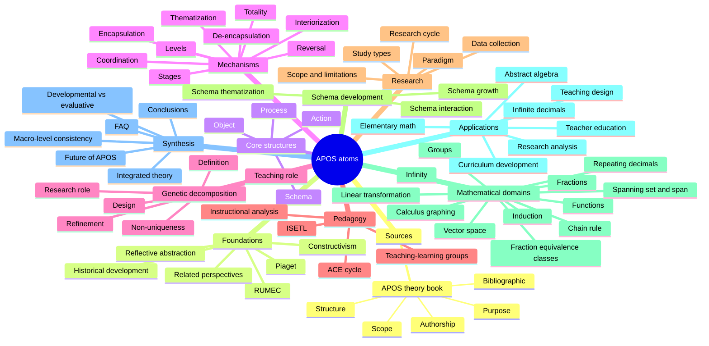

# APOS atom taxonomy

Derived from:
- `sources/Arnon et al. (2014). APOS-theory-framework-research-curriculum-development-mathematics-education.pdf`
- prefacio, tabla de contenidos e introducción

## Folder tree

```text
desk/atoms/
  sources/
    apos-theory-book/
      bibliographic/
      authorship/
      purpose/
      scope/
      structure/

  apos/
    foundations/
      constructivism/
      piaget/
      reflective-abstraction/
      historical-development/
      rumec/
      related-theoretical-perspectives/

    core-structures/
      action/
      process/
      object/
      schema/

    mechanisms/
      interiorization/
      encapsulation/
      de-encapsulation/
      coordination/
      reversal/
      thematization/
      totality/
      stages/
      levels/

    genetic-decomposition/
      definition/
      design/
      role-in-research/
      role-in-teaching/
      non-uniqueness/
      refinement/

    pedagogy/
      ace-cycle/
      isetl/
      teaching-learning-groups/
      instructional-analysis/

    research/
      paradigm/
      research-cycle/
      data-collection/
      study-types/
      scope-and-limitations/

    schema-development/
      schema-growth/
      schema-interaction/
      schema-thematization/

    mathematical-domains/
      functions/
      induction/
      spanning-set-and-span/
      linear-transformation/
      vector-space/
      groups/
      repeating-decimals/
      infinity/
      fractions/
      fraction-equivalence-classes/
      calculus-graphing/
      chain-rule/

    applications/
      curriculum-development/
      research-analysis/
      teaching-design/
      elementary-math/
      teacher-education/
      abstract-algebra/
      infinite-decimals/

    synthesis/
      faq/
      conclusions/
      developmental-vs-evaluative/
      macro-level-consistency/
      future-of-apos/
      integrated-theory/
```

## Taxonomy diagram


